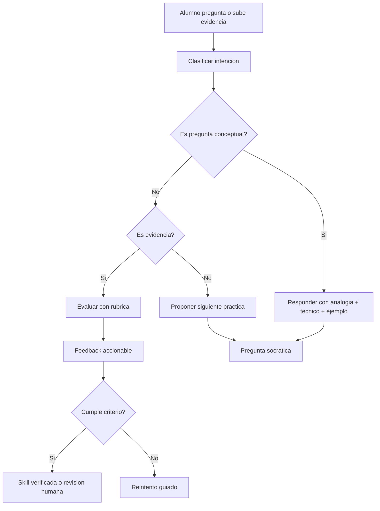

# Sistema de aprendizaje IA para AECODE

Fecha: 2026-06-01  
Uso: diseno de producto educativo, rutas de aprendizaje, skill graph, tutor IA, evidencia y certificacion.

## Tesis

AECODE no debe comportarse como una biblioteca de cursos. Debe comportarse como un sistema de desarrollo de habilidades verificables.

La diferencia:

- curso tradicional: consumir contenido;
- sistema AECODE: diagnosticar, practicar, evidenciar, recibir feedback y demostrar competencia.

## Loop central

```text
Entra -> diagnostico -> ruta -> skill -> practica -> evidencia -> rubrica -> feedback -> skill verificada
```

## North Star

Skills verificadas con evidencia por usuario activo mensual.

Esta metrica fuerza el producto a medir aprendizaje real, no solo vistas, likes o minutos de video.

## Analogía simple

Aprender IA no es leer un manual de manejo. Es aprender a conducir en ciudad, carretera, lluvia y emergencia. AECODE debe crear practicas donde el alumno demuestre que puede operar en escenarios reales.

## Arquitectura del producto

## 1. Diagnostico inicial

Objetivo:

- entender punto de partida;
- detectar brechas;
- identificar objetivo profesional;
- personalizar ruta.

Variables:

- rol;
- experiencia AEC;
- nivel digital;
- nivel IA;
- herramientas usadas;
- objetivo;
- disponibilidad;
- evidencia previa.

Salida:

- nivel;
- ruta recomendada;
- skills prioritarias;
- primera practica.

## 2. Skill graph

Un skill graph conecta habilidades, prerequisitos y evidencias.

Ejemplo:

```text
Fundamentos IA
  -> Prompting estructurado
    -> RAG documental
      -> Agentes con herramientas
        -> Automatizacion PMO
```

Cada nodo debe tener:

- nombre;
- nivel;
- prerequisitos;
- explicacion simple;
- practica;
- evidencia;
- rubrica;
- feedback;
- criterio de verificacion.

## 3. Ruta adaptativa

La ruta no debe ser fija para todos.

Debe adaptarse por:

- diagnostico;
- desempeno;
- evidencia;
- velocidad;
- errores recurrentes;
- objetivo profesional.

Ejemplo:

Un BIM manager con experiencia tecnica pero poca IA puede saltar fundamentos AEC y enfocarse en:

- prompting;
- RAG documental;
- automatizacion;
- agentes de coordinacion;
- evidencia BIM.

Un estudiante puede necesitar:

- fundamentos;
- casos simples;
- practica guiada;
- lenguaje tecnico;
- feedback frecuente.

## 4. Tutor IA

El tutor no debe limitarse a responder preguntas.

Debe:

- explicar con analogias;
- detectar confusion;
- hacer preguntas socraticas;
- adaptar nivel;
- revisar evidencia;
- proponer siguiente reto;
- indicar errores;
- mostrar criterio tecnico;
- pedir fuentes cuando corresponde.

## 5. Practica aplicada

Cada modulo debe cerrar con una practica.

Ejemplos:

| Skill | Practica | Evidencia |
| --- | --- | --- |
| Prompting | crear prompt de diagnostico de proceso | prompt + output + mejora |
| RAG | disenar metadata para documentos de obra | schema + diagrama |
| Agentes | disenar agente PMO | ficha de agente + permisos |
| Evals | crear dataset de prueba | 20 preguntas + criterios |
| Vision | definir piloto de EPP | clases + metrica + flujo |

## 6. Evidencia

Evidencia es el activo que demuestra habilidad.

Puede ser:

- diagrama;
- prompt;
- codigo;
- demo;
- reporte;
- matriz;
- video;
- dataset;
- rubrica;
- decision memo.

La evidencia debe responder:

- que problema resuelve;
- que datos usa;
- que criterio aplica;
- que resultado produce;
- como se valida;
- que riesgo controla.

## 7. Rubrica

Una rubrica evita feedback generico.

Ejemplo para skill "Disenar un agente RAG":

| Criterio | Basico | Intermedio | Avanzado | Experto |
| --- | --- | --- | --- | --- |
| Objetivo | vago | definido | medible | conectado a KPI |
| Fuentes | lista documentos | clasifica fuentes | incluye metadata | evalua vigencia y permisos |
| Arquitectura | chat simple | RAG basico | RAG + tools | agente con estado y evals |
| Seguridad | no considerada | datos sensibles | permisos | threat model |
| Evidencia | descripcion | diagrama | demo | trazas + evals |

## 8. Feedback IA/humano

Feedback IA:

- rapido;
- escalable;
- consistente;
- util para primera revision.

Feedback humano:

- criterio de dominio;
- excepciones;
- profundidad;
- validacion final;
- juicio profesional.

Regla:

La IA puede preevaluar. El humano valida evidencias de alto impacto.

## 9. Skill Passport

El Skill Passport debe mostrar:

- skills verificadas;
- evidencias;
- nivel;
- fecha;
- rubrica;
- feedback;
- proyectos aplicados;
- proxima skill recomendada.

No debe ser solo un certificado bonito. Debe ser un registro de capacidad demostrada.

## 10. Dashboard B2B

Para empresas, AECODE debe responder:

1. que habilidades tiene mi equipo;
2. que brechas existen;
3. quien esta avanzando;
4. que evidencia se genero;
5. que skills impactan proyectos reales;
6. que rutas conviene financiar.

Indicadores:

- usuarios activos;
- skills iniciadas;
- skills verificadas;
- evidencias enviadas;
- tasa de aprobacion;
- tiempo a verificacion;
- brechas por rol;
- impacto en proyectos.

## Arquitectura IA del sistema

## Componentes

- frontend de aprendizaje;
- motor de diagnostico;
- skill graph;
- tutor IA;
- RAG de contenido;
- evaluador de evidencias;
- rubricas;
- storage de portfolios;
- dashboard B2B;
- trazas y evals.

## Flujo del tutor



## Ejemplo de skill ultra avanzada

Skill:

Disenar un agente IA gobernado para seguimiento PMO en obra.

Prerequisitos:

- fundamentos de LLM;
- RAG;
- prompting estructurado;
- APIs;
- permisos;
- evals;
- procesos PMO.

Practica:

Disena un agente que recibe actas, extrae compromisos, cruza pendientes y propone tareas.

Evidencia:

- ficha de agente;
- diagrama de flujo;
- schema de estado;
- matriz de permisos;
- prompt;
- eval set;
- dashboard mock.

Rubrica:

- objetivo claro;
- datos definidos;
- herramientas con schema;
- aprobacion humana;
- trazabilidad;
- riesgos;
- metrica de exito.

## Preguntas que el tutor debe hacer

1. Que decision mejora esta IA?
2. Que fuente prueba la respuesta?
3. Que parte debe validar un humano?
4. Que output seria evidencia de dominio?
5. Que error seria grave?
6. Como medimos mejora?
7. Que simplificarias para un piloto?

## Diferencia entre contenido y dominio

Contenido:

- videos;
- lecturas;
- ejemplos;
- quizzes.

Dominio:

- explicar;
- aplicar;
- construir;
- defender;
- evaluar;
- mejorar.

AECODE debe vender dominio, no solo contenido.

## Roadmap AECODE IA

## Fase 1: rutas y evidencias

- diagnostico;
- rutas;
- skills;
- rubricas;
- evidencias;
- skill passport inicial.

## Fase 2: tutor IA

- explicaciones adaptativas;
- preguntas socraticas;
- feedback preliminar;
- recomendaciones.

## Fase 3: RAG de contenido

- base de cursos;
- guias;
- casos;
- fuentes;
- respuestas citadas.

## Fase 4: evaluacion avanzada

- evaluador IA;
- revision humana;
- trazas;
- benchmarks;
- deteccion de brechas.

## Fase 5: B2B

- dashboard de equipos;
- matriz de capacidades;
- reportes ejecutivos;
- integracion con proyectos.

## Regla final

Un alumno no se vuelve experto por consumir mas informacion. Se vuelve experto cuando puede producir evidencia de que entiende, aplica y evalua la IA en problemas reales.
