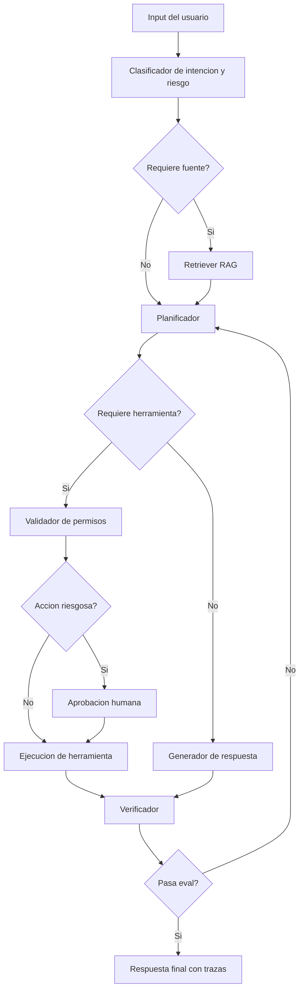

# Arquitectura agentic y frameworks de orquestacion

Fecha: 2026-06-01  
Uso: diseno de agentes GEN+, AECODE, PMO, propuestas, RAG y automatizacion avanzada.

## Tesis

Un agente IA no es un chatbot con nombre. Es un sistema que combina:

- objetivo;
- estado;
- modelo;
- herramientas;
- memoria;
- politicas;
- evaluacion;
- aprobacion humana;
- logs;
- recuperacion ante fallos.

Si falta alguno de estos elementos, el agente puede funcionar en una demo, pero sera dificil de auditar, escalar o confiar.

## Analogía simple

Un agente util se parece a un analista junior con acceso a sistemas. Puede buscar, redactar, comparar y proponer. Pero si le das acceso sin instrucciones, permisos ni supervision, no tienes productividad: tienes riesgo.

## Diferencia entre chatbot, workflow y agente

| Tipo | Que hace | Cuando usarlo | Riesgo |
| --- | --- | --- | --- |
| Chatbot | responde en una conversacion | dudas simples y soporte | respuesta sin accion |
| Workflow | sigue pasos definidos | procesos repetibles | poca adaptacion |
| Agente | decide pasos y usa herramientas | tareas con incertidumbre controlada | acciones mal autorizadas |

Un agente puede contener workflows. Un workflow puede usar modelos. Un chatbot puede ser interfaz de ambos.

## Componentes de una arquitectura agentic

## 1. Objetivo

Debe ser observable y verificable.

Malo:

- "ayuda con proyectos".

Bueno:

- "extrae acuerdos de una reunion, cruza fechas con pendientes abiertos y propone tareas para aprobacion".

## 2. Estado

El estado es la memoria operativa de una ejecucion. Debe guardar:

- objetivo;
- input original;
- pasos completados;
- fuentes consultadas;
- tool calls;
- errores;
- decisiones humanas;
- output parcial;
- output final;
- costo;
- latencia.

Ejemplo:

```ts
type AgentRunState = {
  runId: string;
  userId: string;
  goal: string;
  riskLevel: "low" | "medium" | "high";
  retrievedSources: SourceRef[];
  toolCalls: ToolCallLog[];
  pendingApprovals: Approval[];
  draftOutput: string;
  finalOutput?: string;
  errors: AgentError[];
  costUsd: number;
};
```

## 3. Herramientas

Una herramienta no es solo una funcion. Es un contrato.

Debe definir:

- nombre;
- descripcion;
- schema de argumentos;
- permisos;
- datos permitidos;
- errores;
- logs;
- criterios de aprobacion.

Ejemplo de herramienta:

```json
{
  "name": "create_project_task",
  "description": "Crea una tarea de proyecto despues de aprobacion humana.",
  "arguments": {
    "title": "string",
    "owner": "string",
    "dueDate": "YYYY-MM-DD",
    "sourceEvidence": "string",
    "priority": "low | medium | high"
  },
  "requiresHumanApproval": true
}
```

## 4. Memoria

No toda memoria es buena.

Tipos utiles:

- memoria semantica: conceptos, guias, politicas;
- memoria episodica: decisiones previas de una sesion;
- memoria de preferencias: formato, tono, nivel de detalle;
- memoria operacional: estado de flujo.

Memoria peligrosa:

- secretos;
- datos personales innecesarios;
- inferencias no confirmadas;
- resultados obsoletos;
- errores repetidos como si fueran verdad.

## 5. Human-in-the-loop

El humano debe entrar donde hay:

- alto impacto;
- baja reversibilidad;
- datos sensibles;
- incertidumbre alta;
- decision comercial;
- efecto legal;
- accion externa.

Tipos de control humano:

- aprobar antes de ejecutar;
- editar argumentos de herramienta;
- seleccionar entre alternativas;
- revisar output;
- pausar flujo;
- escalar excepcion.

## 6. Observabilidad

Un agente sin trazas es una caja negra.

Una traza debe mostrar:

- input;
- modelo;
- prompts;
- fuentes recuperadas;
- herramientas llamadas;
- argumentos;
- resultados;
- errores;
- aprobaciones;
- costo;
- latencia;
- output final.

## 7. Evaluacion

Los agentes deben evaluarse por:

- seleccion correcta de herramienta;
- orden correcto de pasos;
- respeto de permisos;
- calidad de salida;
- grounding en fuentes;
- costo por tarea;
- tasa de escalamiento humano;
- errores recuperables;
- satisfaccion del usuario.

## Comparativa de frameworks

## CrewAI

### Paradigma

Roles y tareas.

### Donde brilla

- flujos simples de investigacion;
- generacion de propuestas;
- equipos conceptuales;
- contenido;
- tareas secuenciales.

### Explicacion sencilla

CrewAI se parece a armar una pequena consultora: investigador, redactor, analista, revisor.

### Riesgo

Puede crear "teatro multiagente": muchos roles conversando, pero poco control real de estado, permisos o calidad.

### Uso GEN+

Propuesta comercial:

1. agente investigador;
2. agente arquitecto;
3. agente ROI;
4. agente redactor;
5. agente revisor.

## AutoGen

### Paradigma

Conversacion entre agentes.

### Donde brilla

- debates tecnicos;
- simulaciones;
- revision cruzada;
- ideacion;
- colaboracion exploratoria.

### Explicacion sencilla

AutoGen se parece a una mesa de expertos que conversan. Es fuerte para dinamica, pero requiere moderacion.

### Riesgo

El historial conversacional puede crecer, consumir tokens y perder determinismo. Si no hay reglas, los agentes hablan mas de lo que resuelven.

### Uso GEN+

Debate de arquitectura para elegir entre:

- RAG simple;
- agente con herramientas;
- workflow determinista;
- solucion con vision computacional.

## LangGraph

### Paradigma

Grafo de estado.

### Donde brilla

- flujos largos;
- loops;
- revisiones;
- aprobaciones;
- estado persistente;
- auditoria;
- recuperacion de fallos;
- human-in-the-loop.

### Explicacion sencilla

LangGraph es como disenar un plano electrico de decisiones. Cada nodo cumple una funcion y el estado viaja por el grafo.

### Riesgo

Mayor complejidad tecnica. Si el estado esta mal disenado, el grafo se vuelve dificil de mantener.

### Uso GEN+

Agente PMO:

1. recibe acta;
2. extrae compromisos;
3. recupera pendientes previos;
4. cruza fechas;
5. detecta riesgos;
6. propone tareas;
7. pide aprobacion;
8. actualiza dashboard;
9. guarda traza.

## Patron de grafo stateful



## Router cognitivo

El router decide el camino correcto:

| Caso | Ruta |
| --- | --- |
| pregunta simple | respuesta directa |
| pregunta documental | RAG |
| accion externa | herramienta + permiso |
| alto riesgo | humano |
| codigo critico | razonamiento + pruebas |
| documento sensible | entorno protegido |

## Matriz de autonomia

| Accion | Puede leer | Puede proponer | Puede ejecutar | Requiere aprobacion |
| --- | --- | --- | --- | --- |
| resumir guia publica | si | si | si | no |
| crear tarea interna | si | si | condicionado | si |
| enviar correo a cliente | si | si | no directo | si |
| modificar precio | si | si | no | siempre |
| borrar dato | no | no | no | bloqueado |

## Casos GEN+

## Agente de propuestas

Entrada:

- brief;
- cliente;
- dolor;
- presupuesto estimado;
- fuentes GEN+.

Salida:

- propuesta;
- alcance;
- ROI;
- riesgos;
- supuestos;
- cronograma.

Control:

- Alejandro aprueba narrativa, precio y alcance.

## Agente PMO

Entrada:

- actas;
- cronograma;
- pendientes;
- reportes;
- correos.

Salida:

- compromisos;
- riesgos;
- alertas;
- tareas;
- resumen ejecutivo.

Control:

- jefe de proyecto aprueba tareas y alertas externas.

## Tutor AECODE

Entrada:

- nivel del alumno;
- ruta;
- modulo;
- evidencia;
- rubrica.

Salida:

- explicacion;
- reto;
- feedback;
- decision de competencia;
- siguiente practica.

Control:

- instructor valida evidencias criticas.

## Checklist antes de desplegar un agente

- objetivo unico;
- usuario claro;
- entradas definidas;
- fuentes confiables;
- herramientas con schema;
- permisos minimos;
- logs;
- evals;
- aprobacion humana;
- manejo de errores;
- rollback;
- metrica de exito;
- costo estimado.

## Regla final

No construyas agentes porque suenan avanzados. Construye agentes cuando el flujo necesita decidir pasos, consultar fuentes, usar herramientas, guardar estado y justificar cada accion.
