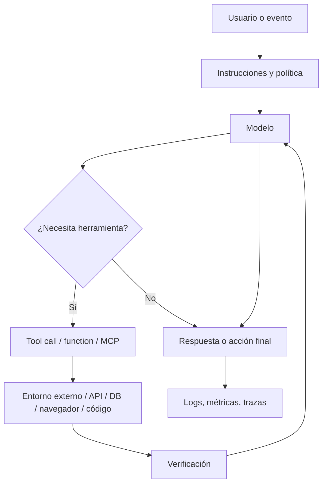
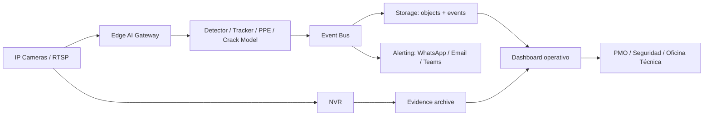
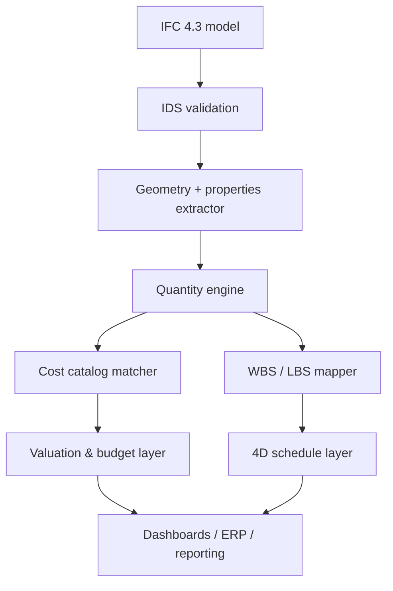
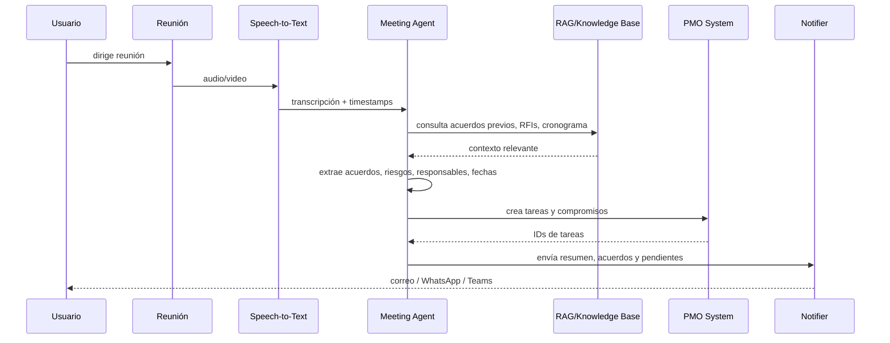
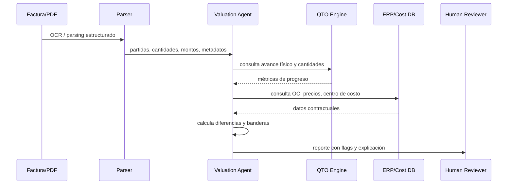
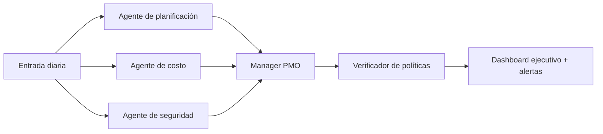

# GEN+ AI AEC — Master Knowledge Base

## Resumen ejecutivo

La tesis central de esta base es simple: la frontera útil ya no es “chat con IA”, sino **sistemas agentivos verificables** que combinan modelos fundacionales, herramientas, recuperación, ejecución de código, memoria operativa y capas de control. Los proveedores líderes convergen en esa dirección: OpenAI estructura su oferta alrededor de Responses API, tools y Agents SDK; Anthropic empuja Claude + Claude Code + tool use + extended thinking; Google ha reforzado Gemini, Managed Agents y Antigravity como plataforma agent-first. El cambio importante no es semántico, sino arquitectónico: el valor real aparece cuando el modelo deja de ser un contestador y pasa a ser un **componente de un sistema**. citeturn35view1turn35view2turn27search0turn13search14turn33view0turn38search0turn38search8turn38search1

Para GEN+ y para AEC en general, la conclusión operativa es todavía más concreta: la IA crea ventaja cuando se aplica sobre **flujos con datos, contratos de información y métricas cierres de ciclo**, no cuando se despliega como licencia genérica de copiloto. En construcción, BIM/IFC/IDS, metrados, cronogramas, valorizaciones, evidencia fotográfica, actas, RFIs, submittals y control de campo ya ofrecen superficies de automatización medibles; además, la literatura técnica sobre computer vision, quantity take-off y scheduling confirma que seguridad, trazabilidad documental, extracción de cantidades, 4D y mantenimiento predictivo son casos maduros para una arquitectura híbrida humano+IA. citeturn18search1turn19search2turn19search3turn19search0turn19search4turn19search9turn18search4turn18search6

La arquitectura recomendada para GEN+ no es “un megaagente que hace todo”, sino un **stack en capas**: sistemas de registro deterministas para datos críticos; capa semántica con embeddings y recuperación; agentes especializados para coordinación, extracción, conciliación y verificación; y una instrumentación fuerte de costos, calidad y riesgo. Esta recomendación está alineada con la práctica que OpenAI describe para agentes —empezar con un solo agente bien equipado y sólo pasar a multiagente cuando la claridad o la complejidad lo exigen— y con la lógica de gobernanza y control explicitada por NIST AI RMF. citeturn34view0turn40view0

En AEC, la mayor oportunidad diferencial de GEN+ está en cuatro activos compuestos: **un núcleo openBIM estructurado**, **una capa RAG trazable**, **visión por computadora edge+cloud para evidencia operacional**, y **una PMO agentiva** que cierre el circuito entre reuniones, cronograma, costo, seguridad y valorización. Si esos cuatro activos comparten taxonomía, contratos API y métricas, la empresa no sólo usa IA: **construye infraestructura cognitiva reutilizable**. citeturn18search13turn19search11turn11search0turn11search1turn34view0

## Tabla de contenidos

- [Resumen ejecutivo](#resumen-ejecutivo)
- [Fundamentos históricos y técnicos](#fundamentos-históricos-y-técnicos)
  - [De Turing a los agentes](#de-turing-a-los-agentes)
  - [Cómo predice un LLM](#cómo-predice-un-llm)
  - [Atención y arquitectura Transformer](#atención-y-arquitectura-transformer)
  - [Entrenamiento, inferencia, embeddings, RAG y LoRA](#entrenamiento-inferencia-embeddings-rag-y-lora)
  - [Evaluación, alucinaciones, calibración y chain-of-thought](#evaluación-alucinaciones-calibración-y-chain-of-thought)
- [Estado actual del ecosistema](#estado-actual-del-ecosistema)
  - [Modelos y APIs](#modelos-y-apis)
  - [Herramientas agentivas de desarrollo](#herramientas-agentivas-de-desarrollo)
  - [Creatividad, voz, vídeo, automatización y visión](#creatividad-voz-vídeo-automatización-y-visión)
  - [Google I/O y la dirección del mercado](#google-io-y-la-dirección-del-mercado)
- [Arquitecturas, agentes y operación en producción](#arquitecturas-agentes-y-operación-en-producción)
  - [Patrones de agentes](#patrones-de-agentes)
  - [Memoria, planificación, verificación y MCP](#memoria-planificación-verificación-y-mcp)
  - [Despliegue edge, cloud e híbrido](#despliegue-edge-cloud-e-híbrido)
  - [Economía de tokens y control de costos](#economía-de-tokens-y-control-de-costos)
  - [Seguridad y gobernanza](#seguridad-y-gobernanza)
- [Arquitecturas de IA para AEC](#arquitecturas-de-ia-para-aec)
  - [Visión en obra y arquitectura edge](#visión-en-obra-y-arquitectura-edge)
  - [BIM, IFC, IDS, metrados y QA/QC](#bim-ifc-ids-metrados-y-qaqc)
  - [Cronograma, valorizaciones y mantenimiento predictivo](#cronograma-valorizaciones-y-mantenimiento-predictivo)
  - [Esquemas de datos, contratos API y secuencias](#esquemas-de-datos-contratos-api-y-secuencias)
- [Stack recomendado y playbooks operativos](#stack-recomendado-y-playbooks-operativos)
  - [Stack web y AI-native](#stack-web-y-ai-native)
  - [Diseño de pilotos y ROI](#diseño-de-pilotos-y-roi)
  - [Datos, etiquetado, selección de modelo y rollout](#datos-etiquetado-selección-de-modelo-y-rollout)
  - [Checklist de gobernanza e incident response](#checklist-de-gobernanza-e-incident-response)
- [Catálogo de prompts, plantillas y referencias](#catálogo-de-prompts-plantillas-y-referencias)
  - [Prompt library reusable](#prompt-library-reusable)
  - [Buenas prácticas de prompt engineering](#buenas-prácticas-de-prompt-engineering)
  - [Preguntas abiertas y limitaciones](#preguntas-abiertas-y-limitaciones)
  - [Referencias](#referencias)

## Fundamentos históricos y técnicos

### De Turing a los agentes

La genealogía útil de la IA moderna arranca con tres hitos. Primero, Turing formuló en 1950 la pregunta operacional de si una máquina puede exhibir un comportamiento indistinguible del de un humano en conversación, con lo que desplazó el problema desde la metafísica hacia un criterio observable. Segundo, el proyecto de Dartmouth de 1956 acuñó el término “artificial intelligence” y postuló formalmente que aspectos del aprendizaje y la inteligencia podían describirse con tal precisión que una máquina podría simularlos. Tercero, durante varias décadas dominó un enfoque simbólico: representación explícita, reglas, búsqueda, lógica y, más tarde, sistemas expertos. citeturn1search3turn1search4turn22search0turn23search5turn23search16

Ese paradigma simbólico fue eficaz cuando el conocimiento podía formalizarse como reglas y heurísticas, pero mostró límites en percepción, ambigüedad, escala y costo de mantenimiento del conocimiento. La fase siguiente, machine learning, desplazó el centro desde “programar reglas” hacia “ajustar parámetros a partir de datos”; deep learning llevó ese cambio mucho más lejos al aprender representaciones jerárquicas con múltiples capas y produjo saltos de rendimiento en visión, voz y NLP. El impacto de AlexNet en ImageNet y la revisión de LeCun, Bengio y Hinton ayudan a ubicar ese giro: la ventaja ya no estaba en la ingeniería manual de features, sino en representación aprendida a escala. citeturn25search1turn25search0turn25search2

El tercer gran salto fue Transformer. “Attention Is All You Need” reemplazó la dependencia fuerte de recurrencia y convolución por mecanismos de atención escalables y paralelizables, y abrió la puerta a modelos preentrenados de gran escala. GPT-3 confirmó después que el entrenamiento autoregresivo a escala produce capacidades few-shot no triviales; RAG añadió acceso explícito a memoria externa; LoRA y otras técnicas PEFT permitieron adaptar modelos grandes sin reentrenarlos por completo. El resultado es la pila actual: modelos base + recuperación + herramientas + agentes. citeturn21search0turn14search3turn2search0turn1search5

> **Explicación Feynman:** la IA simbólica era como un manual operativo lleno de reglas “si-entonces”; el deep learning fue como contratar a un aprendiz que mira millones de ejemplos hasta captar patrones; el Transformer fue como darle a ese aprendiz una mesa de trabajo donde puede mirar cualquier parte del documento a la vez y decidir qué fragmentos importan más en cada instante. citeturn22search0turn25search0turn21search0

### Cómo predice un LLM

Un LLM no “piensa en oraciones” primero y luego las emite. Formalmente, modela una distribución condicional sobre el siguiente token dado el contexto anterior. Si el contexto es \(x_{<t}\), el modelo produce un estado interno \(h_t=f_\theta(x_{<t})\), luego unos **logits** \(z_t=W_oh_t+b\), y finalmente una distribución de probabilidad sobre el vocabulario mediante softmax:

\[
p_\theta(x_t=i \mid x_{<t})=\frac{\exp(z_{t,i}/\tau)}{\sum_j \exp(z_{t,j}/\tau)}
\]

donde \(\tau\) es la temperatura de muestreo. El siguiente token puede elegirse por argmax, top-k, nucleus sampling o variantes afines. En otras palabras: el modelo convierte contexto en puntuaciones, las normaliza y muestrea una continuación. Esa es la mecánica nuclear de “predecir”. citeturn14search3turn21search0

Durante entrenamiento, el objetivo estándar es minimizar la **negative log-likelihood** del token verdadero:

\[
\mathcal{L}(\theta)=-\sum_{t=1}^{T}\log p_\theta(x_t \mid x_{<t})
\]

Eso significa que el modelo ajusta parámetros para asignar más probabilidad a continuaciones observadas en los datos. Esta formulación explica una de las intuiciones más importantes para ingeniería: el modelo es extremadamente bueno en **modelar regularidades estadístico-semánticas**, pero eso no implica veracidad, grounding ni cumplimiento procedimental por sí mismos. Por eso los sistemas serios añaden retrieval, tool use, guardrails y verificadores. citeturn14search3turn14search6turn35view1turn35view2

Los **tokens** son unidades subléxicas o textuales que el tokenizer transforma desde texto crudo a ids discretos. El costo de inferencia y el contexto dependen de tokens, no de palabras humanas. Esta observación parece trivial, pero es decisiva para producto: un prompt largo, documentos repetidos, JSON verboso o historiales sin compresión inflan costo, latencia y probabilidad de deriva. Los proveedores ahora exponen explícitamente herramientas para reducir ese costo, como prompt caching y context caching. citeturn35view3turn35view5turn35view6

> **Analogía técnica:** logits son como una pizarra de puntuaciones preliminares de todos los siguientes movimientos posibles; softmax convierte esa pizarra en una ruleta ponderada; la temperatura decide si la ruleta será conservadora o exploratoria. Un modelo “alucina” no porque quiera engañar, sino porque a veces la continuación estadísticamente plausible no coincide con el mundo real. citeturn14search6turn26search18

### Atención y arquitectura Transformer

La operación canónica de self-attention parte de una matriz de representaciones \(X\) y calcula consultas, llaves y valores:

\[
Q=XW_Q,\quad K=XW_K,\quad V=XW_V
\]

La atención ponderada es:

\[
\text{Attention}(Q,K,V)=\text{softmax}\left(\frac{QK^T}{\sqrt{d_k}}\right)V
\]

y multi-head attention se define como la concatenación de varias cabezas de atención seguida de una proyección lineal \(W_O\). La división por \(\sqrt{d_k}\) estabiliza magnitudes de los productos punto. La intuición es poderosa: cada token puede aprender **a qué otros tokens atender** y con qué intensidad, en lugar de limitarse a una vecindad fija o a una recurrencia secuencial. citeturn21search0

A nivel de bloques, un Transformer combina embeddings posicionales, capas de multi-head self-attention, MLPs feed-forward y conexiones residuales con normalización. Variantes decoder-only —la línea GPT— son las más relevantes para LLMs generativos porque usan atención causal: cada token sólo ve el pasado. Variantes encoder-only —como BERT— son excelentes para representación y comprensión, y explican por qué retrieval, reranking y clasificación siguen usando familias no puramente generativas. citeturn21search0turn21search10


El punto decisivo para arquitectura de producto es que **atención no equivale a memoria confiable**. La ventana de contexto permite condicionar la respuesta, pero no sustituye una base de conocimiento indexada ni una capa de herramientas. El mercado actual refleja esto en sus APIs: OpenAI ofrece file search, function calling y MCP; Gemini expone grounding con Google Search, embeddings y tools; Anthropic organiza su oferta en tools, contexto y extended thinking. El patrón de convergencia es inequívoco. citeturn35view2turn26search2turn35view8turn13search14

### Entrenamiento, inferencia, embeddings, RAG y LoRA

Conviene separar cuatro momentos que a menudo se confunden. **Pretraining** ajusta billones o miles de millones de parámetros sobre grandes corpus. **Supervised fine-tuning** adapta comportamiento con ejemplos de entrada-salida. **PEFT/LoRA** inserta actualizaciones de bajo rango en capas lineales para reducir memoria y costo. Y **in-context learning** no cambia pesos: usa el contexto del prompt para inducir comportamiento temporal. Cada técnica resuelve un problema distinto, y elegir mal suele disparar costos sin mejorar resultados de negocio. citeturn14search3turn28search12turn1search5turn28search4

Las **embeddings** convierten texto —y cada vez más, imágenes, audio, video y documentos— en vectores densos que capturan proximidad semántica. OpenAI describe sus embeddings como “turn text into numbers” para casos como search; Gemini ya expone `gemini-embedding-2` como embedding multimodal en un espacio unificado, con 3072 dimensiones por defecto y truncamiento configurable. Esto importa mucho para GEN+: una buena capa de embeddings es la base de buscadores semánticos de RFIs, submittals, especificaciones, lecciones aprendidas, planos y transcripciones. citeturn35view0turn35view8turn37view2turn37view3

**RAG** no es “dar contexto al prompt” a mano; es una arquitectura explícita donde se indexa conocimiento externo, se recuperan fragmentos relevantes y luego se condiciona la generación con ese contexto. La versión clásica de Lewis et al. lo plantea para tareas knowledge-intensive; las implementaciones productivas le añaden chunking, metadatos, filtros, reranking y trazabilidad de citas. Cuando un proveedor ofrece grounding o file search, está empaquetando partes de esa misma idea. citeturn2search0turn26search2turn35view2turn16search3turn17search0turn17search1turn17search2

**LoRA** y PEFT importan porque el grueso del valor empresarial no proviene de “entrenar un frontier model desde cero”, sino de adaptar modelos y pipelines a vocabularios, formatos y tareas concretas. LoRA introduce matrices de baja dimensión entrenables en capas lineales, con una reducción significativa de parámetros entrenables; NVIDIA y Hugging Face documentan PEFT/LoRA como estrategia estándar para adaptar modelos grandes con menor VRAM y almacenamiento. A la vez, el panorama comercial es heterogéneo: OpenAI mantiene SFT para usos concretos, Gemini traslada el tuning más maduro a su plataforma enterprise, y Anthropic indica que su API directa no ofrece fine-tuning general disponible hoy. citeturn1search5turn28search4turn28search15turn28search12turn28search2turn28search14

> **Regla práctica:** si el problema es “estilo, formato o política”, empiece por prompt + schema + RAG; si es “conocimiento privado de alta rotación”, use RAG; si es “comportamiento estable repetido a gran volumen”, evalúe SFT; si es “adaptación costo-eficiente sobre open models”, use LoRA/PEFT. Esa jerarquía minimiza costo de aprendizaje y maximiza mantenibilidad. citeturn28search12turn2search0turn1search5turn34view0

### Evaluación, alucinaciones, calibración y chain-of-thought

La evaluación robusta requiere separar al menos cuatro planos. Para **conocimiento y comprensión general**, benchmarks como MMLU siguen siendo útiles. Para **código**, HumanEval evalúa corrección funcional y SWE-bench evalúa resolución de issues reales de repositorios. Para **agentes**, GAIA introduce tareas que exigen razonamiento, multimodalidad y tool use. Para **retrieval**, precision/recall, MRR y nDCG siguen siendo los instrumentos offline más comunes. Lo importante no es memorizar benchmarks, sino entender qué parte del sistema están midiendo. citeturn15search2turn15search1turn30search1turn30search3turn16search0turn16search4turn16search5

Las **alucinaciones** son salidas plausibles pero no sustentadas. TruthfulQA mostró un punto incómodo: modelos grandes pueden reproducir falsedades humanas populares porque aprenden distribuciones de texto, no verdad epistémica. Por eso grounding, retrieval y citas son medidas de arquitectura, no solamente “trucos de prompting”. Google documenta que grounding con Search mejora actualidad y citabilidad; OpenAI estructura herramientas para búsqueda y file search; NIST insiste en confiabilidad, seguridad y transparencia como atributos de IA confiable. citeturn14search6turn26search2turn26search18turn35view2turn40view0

La **calibración** es otro problema distinto: que una salida parezca muy segura no significa que su probabilidad implícita esté bien alineada con la realidad. Guo et al. mostraron que redes modernas pueden estar mal calibradas y que temperature scaling ayuda en clasificación; en LLMs generativos, el problema es más difícil, pero la intuición sigue viva: combine scores, abstención, verificadores, chequeo por herramientas y tests ejecutables cuando la salida tenga consecuencias operativas. citeturn15search0

**Chain-of-thought** y razonamiento visible merecen una lectura sobria. La evidencia académica muestra que CoT y self-consistency mejoran desempeño en tareas complejas; la evidencia de producto muestra que OpenAI, Anthropic y Google han incorporado “reasoning effort”, “extended thinking” o “thinking” con presupuestos explícitos. Pero exponer toda la traza interna no siempre es deseable: puede encarecer, filtrar detalles internos inestables o añadir ruido. En producción, suele ser mejor pedir **resúmenes de razonamiento, trazas de verificación, outputs estructurados y evidencia de tool calls**, no monólogos largos del modelo. citeturn14search0turn14search1turn20search0turn20search1turn20search2

## Estado actual del ecosistema

### Modelos y APIs

El mercado de modelos ha convergido alrededor de cuatro capacidades base: **multimodalidad nativa, tool use, grounding/retrieval y variantes con distinto trade-off de costo/latencia**. OpenAI indica que sus modelos más recientes soportan texto e imagen como entrada, texto como salida, visión y uso vía Responses API; Anthropic organiza Claude alrededor de modelos Opus/Sonnet/Haiku y capacidades como tools, web search, files y extended thinking; Gemini expone tools, function calling, grounding con Search, embeddings multimodales y, en su línea reciente, modelos optimizados para razonamiento, grounding o alta eficiencia. citeturn35view7turn13search14turn13search1turn26search0turn26search2turn35view8turn37view0turn37view1

La siguiente tabla no pretende dar un “ganador absoluto”; resume, con las páginas oficiales consultadas, el **posicionamiento operativo** más útil para arquitectura. Las descripciones de “latencia” y “accuracy” son cualitativas porque los proveedores no publican una métrica homogénea y comparable en una sola suite común para todos los modelos. citeturn35view7turn35view4turn35view6turn37view0turn37view1

| Familia | Posicionamiento oficial | Trade-off principal | Precio oficial visible |
|---|---|---|---|
| OpenAI GPT-5.5 / GPT-5.4 | GPT-5.5 como flagship para razonamiento complejo y código; GPT-5.4-mini/nano para menor latencia y costo | Más capacidad suele implicar más costo; mini/nano optimizan tiempo y presupuesto | GPT-5.5: USD 12.50 in / 75 out por 1M tokens; GPT-5.4: USD 5 in / 30 out; GPT-5.4-mini: USD 1.5 in / 9 out citeturn35view4turn35view7 |
| Claude Opus / Sonnet / Haiku | Opus para máxima capacidad; Sonnet como generalista premium; Haiku como opción ligera | Anthropic explicita equilibrio entre capacidad, velocidad y costo | Opus 4.8: USD 5 in / 25 out; Sonnet 4.6: USD 3 in / 15 out; Haiku 4.5: USD 1 in / 5 out por 1M tokens citeturn35view6turn13search4 |
| Gemini 2.5 Pro / Flash / Flash-Lite | Pro para coding/reasoning; Flash como híbrido con thinking budgets; Flash-Lite para escala y costo | Google segmenta fuerte por razonamiento, grounding y throughput | 2.5 Pro: USD 2.25 in / 18 out visibles en pricing; 2.5 Flash: USD 0.54 in / 4.5 out; 2.5 Flash-Lite preview: USD 0.05 in / 0.20 out por 1M tokens citeturn37view0turn36view2 |

La comparación de costos por token es útil, pero engañosa si se toma fuera de contexto. Un modelo más barato puede requerir más retries, más herramientas auxiliares o más trabajo humano de corrección; un modelo más caro puede amortizarse si resuelve tareas de mayor complejidad con menos iteraciones. La propia documentación de OpenAI y Anthropic insiste en escoger modelo según complejidad, latencia y costo, no por precio unitario aislado. citeturn34view0turn13search4turn35view7

### Herramientas agentivas de desarrollo

En desarrollo de software, el patrón dominante ya no es “autocomplete”, sino **agentic coding**. Claude Code se define como una herramienta agentiva que lee el codebase, edita archivos, ejecuta comandos e integra herramientas de desarrollo desde terminal, IDE, desktop y browser. Codex se presenta como un agente cloud que trabaja en tareas paralelas, cada una en un sandbox aislado con el repositorio precargado. Cursor, Windsurf, Replit Agent, v0 y Antigravity se mueven en la misma dirección: más contexto, más tools, más ejecución, más verificación y más despliegue. citeturn33view0turn33view1turn33view3turn33view4turn8search12turn31view1turn31view3turn31view2turn38search1turn38search8

| Herramienta | Qué hace mejor | Fortalezas técnicas visibles | Riesgo o límite práctico |
|---|---|---|---|
| Claude Code | Trabajo profundo sobre repositorio desde CLI/IDE | Lee codebase, edita archivos, ejecuta comandos, integra VS Code/JetBrains/Slack/CI; control de permisos y costos documentado citeturn33view0turn33view1turn33view2 | Coste variable por consumo y tamaño del contexto; conviene pilotar y medir usage real citeturn33view2 |
| OpenAI Codex | Paralelizar tareas de ingeniería en sandbox cloud | Tareas paralelas, entorno aislado por tarea, ejecución de tests/linters/type checkers, skills y worktrees para flujos multiagente citeturn33view3turn33view4 | Más fuerte en workflows cloud-native que en operaciones locales directas |
| Cursor | IDE agent-native para devs expertos | Documentación oficial centrada en Agent, Rules, MCP, Skills y CLI citeturn8search0turn8search12 | Mucha potencia depende de reglas/contexto bien configurados |
| Windsurf | IDE AI-native con Cascade | Cascade, MCP, memories/rules, workflows, worktrees y context awareness en la documentación oficial citeturn31view1 | La propia documentación advierte que puede estar desactualizada frente al producto real |
| Replit Agent | De idea a app/deployment en browser | Plan mode, modos Lite/Economy/Power, connected services, construcción y publishing integrados citeturn31view3 | Excelente para velocidad; menos ideal como sistema de control fino de arquitectura enterprise |
| v0 | UI/full-stack rápido sobre stack web moderno | Prompting, Figma/files, sandbox, terminal, APIs externas, MCP integrations y despliegue inmediato citeturn31view2 | Brilla en prototipado y front/full-stack web; requiere supervisión para separación de dominios y backend serio |
| Antigravity | Plataforma agent-first de Google | Planea, ejecuta y verifica tareas a través de editor, terminal y browser; en 2026 suma Managed Agents y CLI dedicado citeturn38search1turn38search8turn38search3 | Ecosistema muy cambiante; requiere vigilar cambios de SDK/CLI y snapshots de producto |

La implicación estratégica para GEN+ es clara: estas herramientas elevan brutalmente la productividad de prototipado, scaffolding, refactor, documentación, PR automation y testing, pero no sustituyen decisiones de arquitectura, control de datos ni ownership técnico. El cuello de botella se mueve desde “escribir código” hacia “definir bien el sistema, el contrato y el criterio de aceptación”. citeturn33view1turn34view0turn38search1

### Creatividad, voz, vídeo, automatización y visión

El ecosistema complementario puede agruparse mejor por función que por marca. Para **grounded search y research runtime**, Perplexity ofrece Search, Agent, Sonar y Embeddings APIs. Para **video generativo**, Runway expone APIs para generación desde texto, imagen o video. Para **voz y agentes conversacionales**, ElevenLabs ofrece TTS, STT, clonación de voz y agentes multimodales. Para **imagen**, Midjourney sigue centrado en prompting y versiones de modelo; Adobe Firefly ofrece APIs de generación y servicios de producción creativa empresariales. citeturn9search12turn9search8turn9search1turn9search13turn9search2turn9search10turn9search14turn9search3turn9search19turn10search0turn10search4

Para **automatización y orquestación**, n8n combina automatización visual con self-hosting y código; Make ha incorporado AI Agents dentro de su plataforma de escenarios; Zapier ya habla explícitamente de AI workflows, agents y MCP con miles de apps conectables. Para **visión por computadora productiva**, Roboflow cubre dataset, anotación, entrenamiento, inferencia y despliegue; NVIDIA Jetson aporta la base edge para correr inferencia local cerca de cámaras y sensores. El término **“Robopilot”** no aparece como un producto dominante y unívoco en fuentes primarias accesibles: en el material encontrado, designa al menos un proyecto open-source de visión autónoma y un marco de investigación robótica con el mismo nombre, por lo que conviene tratarlo como referencia ambigua y no como categoría de compra cerrada. citeturn10search1turn10search12turn10search13turn10search17turn10search3turn10search18turn10search10turn11search0turn11search1turn12search1turn11search6

### Google I/O y la dirección del mercado

Los anuncios recientes de Google son particularmente útiles para leer la dirección del mercado porque no son aislados: forman una narrativa coherente. I/O 2026 destacó Gemini 3.5, la ampliación de Antigravity, nuevas capacidades del Gemini API y Managed Agents en sandbox seguro; además, Google enmarca explícitamente el salto desde IA “assistive” hacia IA “agentic”. El mismo conjunto de anuncios conecta modelos, SDKs, CLI, grounding, sandboxes y agentes gestionados. citeturn38search0turn38search6turn38search8turn38search14

La señal estratégica aquí es importante: los grandes proveedores ya no compiten sólo en benchmark de texto, sino en **sistema completo de ejecución**. Eso incluye protocolos de integración, entornos aislados, observabilidad, equipos multiagente, grounding, APIs de tools y productividad para developers. Dicho sin romanticismo: la guerra dejó de ser “quién responde mejor” y pasó a ser “quién resuelve mejor trabajo real con menos fricción operativa”. citeturn35view2turn34view0turn38search0turn38search8

## Arquitecturas, agentes y operación en producción

### Patrones de agentes

Un agente serio es una **aplicación que ejecuta un loop**, no un prompt bonito. OpenAI lo define de manera directa: agentes son aplicaciones que planifican, llaman herramientas, colaboran entre especialistas y conservan suficiente estado para completar trabajo multietapa. Su guía práctica divide la orquestación en dos familias: sistemas de agente único bien equipado y sistemas multiagente coordinados. Además, recomienda maximizar primero la capacidad de un agente antes de fragmentar el sistema. Esa recomendación merece tomarse muy en serio: muchas organizaciones saltan demasiado pronto a grafos complejos y acaban orquestando caos. citeturn27search0turn34view0



La arquitectura de agentes útil en empresa suele requerir cinco piezas. **Memoria operativa** para estado de la conversación o run. **Memoria semántica** para recuperación desde conocimiento persistente. **Planificación** para descomponer objetivos. **Tool use** para actuar sobre sistemas externos. **Verificación** para chequear que la acción producida cumple restricciones. Sin la quinta pieza, lo que se tiene no es un agente confiable, sino un generador con permisos. citeturn34view0turn35view1turn35view2

### Memoria, planificación, verificación y MCP

La memoria en agentes no debe entenderse como “recordar todo”. Hay al menos tres capas convenientes. La primera es **session memory**: estado del run actual. La segunda es **memory by retrieval**: documentos o eventos recuperados desde un índice. La tercera es **rules/skills/policies**: instrucciones persistentes que condicionan comportamiento. Windsurf documenta memories/rules y worktrees; Claude Code documenta instrucciones, prompt caching y skills; Codex documenta skills y worktrees; MPC/MCP estandariza la forma de exponer herramientas y contexto externos a aplicaciones LLM. citeturn31view1turn33view1turn33view4turn29search0turn29search6turn29search8

El **Model Context Protocol** merece atención especial. La especificación oficial lo define como un protocolo abierto para integrar aplicaciones LLM con herramientas y fuentes de datos externas; Anthropic lo introdujo como estándar abierto para conexiones bidireccionales seguras; OpenAI ya lo soporta en tools y en el ecosistema de Agents SDK. En términos arquitectónicos, MCP no sustituye function calling; lo generaliza como **capa portable de integración**. Para GEN+, esto es clave porque reduce lock-in cuando se desean agentes que consulten BIM, ERP, WhatsApp, Notion, SharePoint, Drive o repositorios técnicos bajo una interfaz consistente. citeturn29search0turn29search6turn29search8turn29search9turn29search15

La verificación debe ser de varios tipos. Verificación semántica: ¿la salida responde la pregunta? Verificación estructural: ¿cumple schema JSON o contrato API? Verificación procedimental: ¿se ejecutó la herramienta correcta? Verificación de negocio: ¿el resultado es reconciliable con presupuesto, cronograma o política interna? OpenAI coloca guardrails y risk ratings como defensa por capas; NIST insiste en que la gobernanza sea transversal a todo el ciclo. Esa combinación —policy + schema + verifier + human escalation— es mucho más robusta que “prompt engineering” aislado. citeturn34view0turn40view0

### Despliegue edge, cloud e híbrido

En términos de infraestructura, existen tres patrones válidos. **Edge**: inferencia y preprocesamiento cerca del dato, ideal para video, sensores, latencias duras o privacidad. **Cloud**: contexto amplio, sandboxes, colaboración multiagente, modelos frontier y elasticidad. **Híbrido**: preprocesado y detección local; razonamiento, conciliación y supervisión en la nube. NVIDIA posiciona JetPack/Jetson como base integral para aplicaciones de IA embebida; Roboflow Inference se presenta como despliegue open-source de alto rendimiento que puede correr localmente; y los proveedores de agentes en cloud enfatizan sandboxes controlados y tareas de largo horizonte. citeturn11search1turn11search8turn11search0turn33view3turn38search8

Para AEC, el patrón **híbrido** suele ser el más razonable. Es una inferencia técnica sustentada por las propiedades del dominio: video continuo y modelos de visión consumen ancho de banda y latencia de forma muy distinta a un agente que resume actas, consulta cronograma o concilia valorizaciones; además, BIM/IFC, document management y suites corporativas rara vez viven todos en el mismo plano. En términos prácticos, conviene ejecutar detección y compresión cerca de la obra, y reservar la nube para razonamiento cross-source, auditoría, reporting y simulación. citeturn11search1turn11search0turn18search4turn18search6turn34view0

### Economía de tokens y control de costos

El costo total de un sistema LLM no es sólo “precio por millón de tokens”. Puede expresarse como:

\[
\text{Costo total} \approx C_{in} + C_{out} + C_{cache} + C_{tools} + C_{storage} + C_{retries} + C_{human\_review}
\]

donde \(C_{in}\) y \(C_{out}\) son consumo de tokens, \(C_{cache}\) depende de hits o writes, \(C_{tools}\) incluye búsquedas o ejecuciones asociadas, y \(C_{human\_review}\) representa retrabajo. OpenAI y Anthropic documentan prompt caching; Google separa precio de modelo y precio de herramientas como Search grounding. Esto obliga a tratar costos como una variable de arquitectura, no sólo de procurement. citeturn35view3turn35view4turn35view5turn35view6

Un ejemplo simple ayuda. Suponga 1,000 requests mensuales, cada una con 100k tokens de entrada y 10k de salida. A volumen equivalente de tokens, el costo base visible sería aproximadamente USD 800 en GPT-5.4, USD 450 en Claude Sonnet 4.6 y USD 99 en Gemini 2.5 Flash, **antes** de considerar herramientas, retries, grounding, caching o revisión humana. No son equivalentes funcionales perfectos; el punto es mostrar cuánto se deforma el presupuesto cuando el diseño de contexto o el modelo son sobredimensionados. citeturn35view4turn35view5turn35view6

| Escenario | Fórmula visible | Costo aproximado |
|---|---|---|
| GPT-5.4 | 100M input × USD 5/MTok + 10M output × USD 30/MTok | ~USD 800 citeturn35view4 |
| Claude Sonnet 4.6 | 100M input × USD 3/MTok + 10M output × USD 15/MTok | ~USD 450 citeturn35view6 |
| Gemini 2.5 Flash | 100M input × USD 0.54/MTok + 10M output × USD 4.5/MTok | ~USD 99 citeturn36view2 |

El control de costos eficaz sigue cuatro reglas. Primero, **prefijos estáticos al inicio** para maximizar cache hits. Segundo, **compresión y summarization programática** del historial. Tercero, **routing por dificultad**: modelos grandes para casos difíciles, económicos para clasificación, extracción o borradores. Cuarto, **tool use estructurado** para no gastar tokens resolviendo con texto algo que debe resolver una función. Este es el tipo de disciplina que separa una demo de un sistema escalable. citeturn35view3turn34view0turn13search4turn37view0

### Seguridad y gobernanza

NIST AI RMF 1.0 sigue siendo una referencia especialmente útil porque no intenta adivinar un único stack, sino organizar el riesgo mediante las funciones **GOVERN, MAP, MEASURE y MANAGE**; además, define atributos de IA confiable como validez y confiabilidad, seguridad, resiliencia, accountability, transparencia, explicabilidad, privacidad reforzada y fairness con sesgo dañino gestionado. Para una empresa técnica, esto es valioso porque transforma la conversación desde “qué modelo compro” hacia “qué proceso de riesgo implanto”. citeturn40view0

El perfil NIST para GenAI complementa esa lógica con orientación más específica para sistemas generativos. Del lado regulatorio, el AI Act de la UE establece un marco armonizado y la Comisión publicó guías sobre prácticas prohibidas. Incluso si GEN+ no opera primariamente bajo jurisdicción europea, el AI Act ya funciona como **benchmark de diseño responsable**: prohibición de ciertas prácticas manipulativas, social scoring y varios usos biométricos; énfasis creciente en documentación, trazabilidad y gestión de riesgo. citeturn39search1turn39search2turn39search7turn39search11

La traducción práctica para GEN+ es esta: ningún agente con permisos de escritura, pagos, modificaciones contractuales o comunicación externa debería operar sin **policy layer**, autorización humana por umbral de riesgo, registros auditables, límites de gasto, scopes de herramientas y rollback. En sistemas AEC, donde una salida puede afectar valorizaciones, seguridad o cumplimiento, esta no es una recomendación opcional: es parte del diseño. citeturn34view0turn40view0

## Arquitecturas de IA para AEC

### Visión en obra y arquitectura edge

La arquitectura de visión más robusta para obra no empieza por el modelo; empieza por el **flujo físico y probatorio**. Cámaras IP capturan RTSP; NVR conserva grabación y continuidad; un edge node —típicamente Jetson o equivalente— ejecuta modelos de detección/seguimiento; los eventos se normalizan; la nube o el DC corporativo consolidan dashboards, alertas y trazabilidad. Este patrón es coherente con la documentación de Jetson, con el posicionamiento de Roboflow Inference y con la literatura sobre PPE/compliance en construcción e industria. citeturn11search1turn11search8turn11search0turn18search4turn18search12



Los casos de uso de mayor ROI inicial suelen ser cuatro. **PPE compliance**: casco, chaleco, guantes, zonas restringidas. **Conteo y trazabilidad**: personal, mixers, excavadoras, camiones, franjas horarias. **Condición y defecto**: grietas, corrosión, elementos expuestos, residuos. **Progreso observable**: comparación de estado visual contra hitos o sectores. La revisión sistemática sobre PPE deja claro que ya existe una base relevante de enfoques, datasets y barreras de despliegue; el mejor diseño empresarial no es sólo accuracy, sino manejabilidad de datos, cámara, iluminación, falsos positivos y ciclo de remediación. citeturn18search4turn18search12

### BIM, IFC, IDS, metrados y QA/QC

En la capa BIM, el activo principal no es el visor: es el **contrato semántico**. IFC 4.3 es el estándar abierto para describir activos construidos; IDS permite especificar requisitos de información de forma computable para validar cumplimiento sobre modelos IFC; IfcOpenShell ofrece la librería open-source para leer, escribir y procesar IFC. Si GEN+ quiere construir ventaja compuesta, debe tratar IFC + IDS + catálogos + taxonomías internas como su “esqueleto de datos” interoperable. citeturn18search1turn18search13turn19search2turn19search18turn19search3turn19search11

Los **metrados** son el mejor punto de entrada para IA aplicada a BIM porque conectan geometría, propiedades, costo y cronograma. La literatura reciente sobre QTO automatizado desde BIM subraya la centralidad del quantity take-off para estimación, procurement y planificación, y propone marcos que extraen cantidades del modelo y las externalizan a bases/dashboards. La oportunidad técnica para GEN+ no es sólo “sacar cantidades”, sino **versionarlas, conciliarlas y verificarlas** contra IDS, catálogos, partidas y valorizaciones. citeturn19search0turn19search4



En **QA/QC**, la combinación potente es rule engine + BIM semantics + evidencia multimodal. IDS permite chequear requisitos de información; IFC define objetos, propiedades y relaciones; las fotos de obra y actas pueden indexarse y enlazarse con sectores, elementos IFC y paquetes de trabajo. En otras palabras: la calidad deja de depender de revisar PDFs sueltos y pasa a depender de contrastar un grafo mínimo de verdad con evidencia operativa. citeturn19search2turn19search18turn19search3turn26search1

### Cronograma, valorizaciones y mantenimiento predictivo

La literatura sobre 4D BIM y scheduling muestra dos ideas estables. La primera: vincular tareas del cronograma con objetos/modelos mejora visualización y decisiones logísticas. La segunda: el dolor no suele estar en “tener software”, sino en mantener cronogramas y actualizaciones de campo sincronizados. Ese es precisamente un buen terreno para asistentes conversacionales, extracción desde reuniones, y agentes que propaguen cambios entre actas, WBS, restricciones y lookaheads. citeturn19search9turn19search5turn18search10

Para **valorizaciones**, la arquitectura recomendable es híbrida: extracción determinista de factura/OC/guía/partida; matching con cantidades y avance físico; y luego una capa LLM que explique discrepancias o redacte observaciones. El error común es pedir a un LLM que “entienda todo el PDF y decida”; el patrón correcto es hacer que el modelo trabaje sobre datos ya estructurados, diferencias calculadas y evidencias anexas. Esa estrategia se apoya tanto en la lógica de QTO automatizado como en la guía moderna de agentes con herramientas y outputs estructurados. citeturn19search4turn35view1turn34view0

En **mantenimiento predictivo**, la literatura sobre facilities y O&M muestra que IA puede apoyar reducción de costos y anticipación de fallas cuando se combinan datos de condición, históricos y sensores. Para infraestructura y activos construidos, la oportunidad de GEN+ está en cerrar el ciclo entre inspección visual, evidencia histórica, clasificación de severidad y recomendación de intervención. Edge vision sirve para observabilidad; modelos tabulares/time series sirven para predicción; el LLM sirve para explicación, consulta y documentación. citeturn18search6turn11search1turn11search0

### Esquemas de datos, contratos API y secuencias

A continuación se proponen **esquemas de referencia** para una base de conocimiento y una plataforma de agentes AEC. Son ejemplos sintéticos, diseñados para ser legibles y fáciles de indexar.

#### Esquema mínimo para evento de visión

```json
{
  "event_id": "evt_2026_06_01_000123",
  "project_id": "obras/lima/torre-a",
  "camera_id": "cam_norte_03",
  "timestamp_utc": "2026-06-01T15:23:11Z",
  "model_version": "ppe-yolo-v8.4",
  "detections": [
    {
      "class": "person_without_helmet",
      "confidence": 0.94,
      "bbox": [412, 233, 501, 441]
    }
  ],
  "zone": "frente_bloque_b",
  "severity": "high",
  "evidence_uri": "s3://genplus-vision/evt_2026_06_01_000123.jpg"
}
```

#### Esquema mínimo para objeto BIM enriquecido

```json
{
  "ifc_guid": "3w$Qj7mR95nBqYQx4uB4U1",
  "project_id": "obras/lima/torre-a",
  "ifc_class": "IfcWall",
  "storey": "Nivel 03",
  "zone": "Eje B-4",
  "system": "Arquitectura",
  "properties": {
    "Length": 5.4,
    "Height": 2.8,
    "Thickness": 0.15,
    "FireRating": "2h"
  },
  "quantities": {
    "Area": 15.12,
    "Volume": 2.268
  },
  "wbs_code": "03.02.01",
  "cost_code": "MURO_TABIQUE_15",
  "ids_status": "pass"
}
```

#### Contrato API para extracción de metrados

```http
POST /api/v1/bim/quantities/extract
Content-Type: application/json
Authorization: Bearer <token>

{
  "project_id": "obras/lima/torre-a",
  "ifc_uri": "s3://genplus-bim/torre-a-r12.ifc",
  "quantity_profile": "estructura_v1",
  "group_by": ["ifc_class", "storey", "cost_code"],
  "validate_ids": true
}
```

```json
{
  "run_id": "qto_run_4201",
  "status": "completed",
  "summary": {
    "elements_processed": 18422,
    "ids_failed": 127,
    "rows_generated": 388
  },
  "artifact_uri": "s3://genplus-qto/qto_run_4201.csv"
}
```

#### Contrato API para conciliación de valorización

```http
POST /api/v1/valuation/reconcile
Content-Type: application/json
Authorization: Bearer <token>

{
  "project_id": "obras/lima/torre-a",
  "valuation_period": "2026-05",
  "invoice_uri": "s3://genplus-finance/facturas/f_2048.pdf",
  "progress_source": "qto_run_4201",
  "schedule_source": "primavera_p6_may_2026",
  "tolerance": {
    "quantity_pct": 0.03,
    "price_pct": 0.01
  }
}
```

#### Secuencia para agente de reuniones

El siguiente diagrama resume un patrón de alto valor inicial: transcripción, extracción y asignación. La estructura está alineada con las categorías actuales de tool use, function calling y agentes con loop de verificación. citeturn35view1turn35view2turn34view0turn10search1turn10search3



#### Secuencia para valorización agentiva



#### Secuencia para PMO multiagente



#### Ejemplo Python para agente de reuniones

```python
from typing import Any, Dict, List

def extract_tasks(transcript: str, context_docs: List[str]) -> Dict[str, Any]:
    """
    Ejemplo conceptual: resumen estructurado, no código listo para producción.
    En producción: añadir validación, retries, trazas y control de costos.
    """
    prompt = f"""
    Sistema:
    Eres un agente de PMO AEC. Devuelve JSON válido.
    Objetivo:
    Extraer acuerdos, responsables, riesgos, fechas y bloqueadores.

    Contexto previo:
    {context_docs}

    Transcripción:
    {transcript}
    """
    # Llamada al proveedor/modelo de tu elección
    # response = model.generate(prompt, response_format="json")
    response = {
        "summary": "Se aprobó el frente B, pendiente liberación de acero.",
        "tasks": [
            {
                "title": "Liberar acero frente B",
                "owner": "Oficina Técnica",
                "due_date": "2026-06-03",
                "priority": "high"
            }
        ],
        "risks": [
            {"risk": "Retraso de proveedor", "severity": "high"}
        ]
    }
    return response
```

#### Ejemplo Python para conciliación de valorización

```python
from decimal import Decimal
from typing import Dict, List

def reconcile_items(invoice_items: List[Dict], measured_items: Dict[str, Decimal], tolerance_pct: Decimal):
    results = []
    for item in invoice_items:
        code = item["cost_code"]
        invoiced_qty = Decimal(str(item["quantity"]))
        measured_qty = measured_items.get(code, Decimal("0"))
        if measured_qty == 0:
            delta_pct = Decimal("1.0")
        else:
            delta_pct = abs(invoiced_qty - measured_qty) / measured_qty
        results.append({
            "cost_code": code,
            "invoiced_qty": str(invoiced_qty),
            "measured_qty": str(measured_qty),
            "delta_pct": str(delta_pct),
            "flag": delta_pct > tolerance_pct
        })
    return results
```

#### Ejemplo de flujo n8n para agente de reuniones

```yaml
name: meeting-agent-aec
nodes:
  - type: webhook
    name: receive-recording
  - type: httpRequest
    name: speech-to-text
  - type: vectorSearch
    name: retrieve-project-context
  - type: llm
    name: extract-agreements-json
  - type: if
    name: validate-required-fields
  - type: notion
    name: create-tasks
  - type: email
    name: send-summary
  - type: whatsapp
    name: notify-owners
notes:
  - "Usar JSON schema en salida del LLM"
  - "Separar éxitos, errores y reintentos"
  - "Loggear tokens, latencia y tasa de corrección humana"
```

## Stack recomendado y playbooks operativos

### Stack web y AI-native

Para GEN+, el stack recomendado debe optimizar tres cosas a la vez: **velocidad de iteración**, **interoperabilidad con AEC** y **control operativo**. Una configuración razonable para producto web y AI-native es: frontend TypeScript/React/Next.js; backend principal en TypeScript o Python; workers Python para parsing, visión, BIM y evaluación; Postgres como sistema transaccional; `pgvector` cuando se quiera simplicidad unificada; y Qdrant/Weaviate/Pinecone/Milvus cuando la carga de recuperación, filtros o escalabilidad semántica lo justifique. `pgvector` destaca cuando conviene mantener vectores junto al dato relacional; Qdrant enfatiza hybrid retrieval y APIs REST/gRPC; Weaviate integra objetos + vectores; Pinecone y Milvus priorizan entornos orientados a vector search a escala. citeturn17search2turn17search1turn17search0turn16search3turn17search3

Para desarrollo acelerado de prototipos y UIs, v0 es especialmente útil; para apps browser-native extremas, Replit Agent reduce fricción; para coding profundo de repositorio, Claude Code/Codex/Cursor/Windsurf encajan mejor; para automatización e integraciones rápidas, n8n debería ser la primera opción de GEN+ si el objetivo es mantener self-hosting y extensibilidad técnica, con Make/Zapier como aceleradores cuando la cobertura de integraciones o el time-to-value pese más que la soberanía infra. citeturn31view2turn31view3turn33view0turn33view3turn8search0turn31view1turn10search1turn10search13turn10search18

La regla de oro de stack es la siguiente: **sistema de registro determinista, sistema cognitivo probabilístico**. Todo lo crítico —contratos, costos, aprobaciones, identidad, control de acceso, bitácora, snapshots de IFC, versiones de cronograma— debe vivir en sistemas deterministas. El LLM debe sentarse encima como capa de comprensión, consulta, extracción, explicación y coordinación, no como fuente maestra. Esa separación reduce riesgo, facilita auditoría y hace más baratas las migraciones de proveedor. citeturn40view0turn34view0turn18search1turn19search2

### Diseño de pilotos y ROI

El diseño de pilotos fracasa cuando se promete “transformación” y se mide “uso”. Para un piloto serio, defina primero una **unidad económica concreta**. Ejemplos: minutos ahorrados por acta, reducción de RFIs reabiertos, lead time de valorización, ratio de observaciones repetidas de calidad, horas de consolidación de avance, tiempo de respuesta a incidentes de seguridad. El output del piloto debe ser una mejora operacional observable, no un dashboard bonito. Esta lógica está alineada con la recomendación de arrancar pequeño, medir y establecer baseline que incluso la documentación de costos de Claude Code enfatiza para equipos enterprise. citeturn33view2turn34view0

Un playbook de piloto útil para GEN+ debería seguir esta secuencia:

1. **Elegir proceso con dolor real y repetitividad suficiente.** Reuniones, valorizaciones, metrados, QA/QC documental y seguridad visual suelen ser mejores entradas que “asistente genérico”. citeturn19search4turn18search4turn19search0  
2. **Congelar baseline.** Medir tiempo, errores, retrabajo, backlog, SLA actual y costo por caso. citeturn40view0turn33view2  
3. **Diseñar contrato de salida.** JSON schema, campos obligatorios, explicabilidad mínima, políticas de escalado humano. citeturn35view1turn34view0  
4. **Definir gold set de evaluación.** Casos históricos representativos y casos borde. Para retrieval, usar Recall@k/MRR/nDCG; para extracción, exactitud/F1; para código, tests ejecutables; para agentes, suites tipo GAIA/SWE-bench adaptadas al dominio. citeturn16search0turn16search4turn16search5turn15search1turn30search3turn30search1  
5. **Instrumentar costo y corrección humana.** Sin esto, el ROI queda narrativo. citeturn35view3turn35view4turn35view6  
6. **Desplegar con scope limitado y rollback simple.** No abrir escritura irreversible en el primer sprint. citeturn34view0turn40view0  

### Datos, etiquetado, selección de modelo y rollout

La recolección de datos en AEC debe seguir una priorización pragmática. Primero, **documentos canónicos**: especificaciones, contratos, actas, RFIs, submittals, cronogramas, PDFs de valorización. Segundo, **datos estructurados**: WBS, partidas, centros de costo, identificadores de elementos, catálogos. Tercero, **evidencia operativa**: fotos, video, inspecciones, incidentes. Cuarto, **modelos BIM/IFC**. Si el orden se invierte y se intenta empezar por “todo a la vez”, el sistema semántico nace ruidoso. citeturn18search1turn19search3turn19search2turn11search0

El **etiquetado** debe ser proporcional al uso. Para visión, etiquete sólo las clases que vayan a cerrar un circuito operativo real: PPE, zonas, vehículos, grietas, ocupación. Para RAG, no etiquete documentos enteros: etiquete metadatos críticos, taxonomía, responsables, obra, disciplina, sector, fecha, versión, confidencialidad. Para agentes de conciliación, el etiquetado más valioso a menudo no es lenguaje natural, sino pares de “documento => extracción estructurada correcta”. citeturn18search4turn11search0turn35view1

La **selección de modelo** debería seguir una matriz simple:
- modelos grandes para razonamiento difícil, código complejo y synthesis cross-source;
- modelos económicos para clasificación, extracción, routing y borradores;
- embeddings multimodales cuando se mezclen PDF, imagen, audio y video;
- edge CV en Jetson/Roboflow para detecciones locales y cloud LLM para explicación y coordinación. citeturn35view7turn37view0turn37view3turn11search1turn11search0

El **rollout** debería ser escalonado. Fase inicial con modo “copilot”: todo pasa por revisión humana. Fase intermedia con autopublicación sólo de outputs de bajo riesgo y alta verificabilidad. Fase avanzada con acciones automáticas acotadas por política, scopes y budgets. NIST AI RMF justifica este enfoque outcome-based; OpenAI recomienda guardrails y ratings por nivel de riesgo para funciones. citeturn40view0turn34view0

### Checklist de gobernanza e incident response

Un checklist mínimo de gobernanza para GEN+ debería cubrir los siguientes puntos:

- **Inventario de agentes y modelos** con owner técnico y owner de proceso. citeturn40view0  
- **Clasificación de riesgo por herramienta/acción**: lectura, escritura reversible, escritura irreversible, financiero, contractual, reputacional. citeturn34view0  
- **Políticas de acceso** por entorno, proyecto y tipo de dato. citeturn40view0  
- **Trazabilidad completa**: prompt, contexto recuperado, tool calls, output, corrección humana, costo y latencia. citeturn27search4turn33view2  
- **Snapshots versionados** de knowledge bases, cronogramas e IFC. citeturn18search1turn19search3  
- **Pruebas de regresión** antes de cambio de modelo, chunking o prompt base. citeturn34view0turn30search1  
- **Abstención y escalado humano** cuando falte evidencia suficiente. citeturn14search6turn26search18  
- **Controles MCP/functions** contra inyección, scopes y acceso excesivo. citeturn29search6turn29search9  

Un playbook breve de incident response debería incluir: congelar el agente o la ruta afectada; preservar trazas y contexto; identificar si el fallo fue de modelo, retrieval, herramienta, permiso o dato; aislar el cambio que introdujo la regresión; restaurar snapshot previo; documentar contramedidas; y añadir un caso nuevo al set de evaluación para evitar repetición. Esa cultura de aprendizaje por incidentes es más importante que cualquier benchmark estático. citeturn40view0turn34view0

## Catálogo de prompts, plantillas y referencias

### Prompt library reusable

Los prompts reutilizables más valiosos para GEN+ no son los más “creativos”, sino los que fijan **rol, criterio de verdad, esquema de salida, límites de acción y regla de abstención**. OpenAI y Anthropic coinciden en que instrucciones de alta calidad y herramientas bien descritas son fundamentales; las guías modernas de prompting también recomiendan no arrastrar prompting legado demasiado verboso cuando se usan modelos más capaces. citeturn34view0turn20search12turn13search14

#### Plantilla de sistema para asistente RAG AEC

```text
Eres un asistente técnico AEC de GEN+.
Prioriza fuentes recuperadas del proyecto sobre conocimiento general.
Si falta evidencia suficiente, dilo explícitamente.
No inventes códigos de partida, metrados, fechas, versiones ni responsables.
Devuelve:
1) respuesta principal
2) evidencia usada
3) incertidumbres
4) siguiente acción recomendada
```

#### Plantilla de usuario para consulta de cronograma

```text
Objetivo:
Evaluar riesgo de atraso del paquete {{paquete}}.

Entradas:
- lookahead: {{lookahead}}
- acta más reciente: {{acta}}
- restricciones abiertas: {{restricciones}}
- avance real: {{avance_real}}

Salida requerida en JSON:
{
  "status": "on_track|watch|at_risk",
  "root_causes": [],
  "evidence": [],
  "actions_next_7_days": [],
  "confidence": 0.0
}
```

#### Plantilla few-shot para valorización

```text
Ejemplo 1
Entrada:
- partida: Encofrado vertical
- qty_facturada: 120
- qty_medida: 118
- precio_oc: 45.00
- precio_factura: 45.00
Salida:
{
  "flag": false,
  "reason": "Desvío de cantidad dentro de tolerancia",
  "severity": "low"
}

Ejemplo 2
Entrada:
- partida: Acero fy420
- qty_facturada: 18.5
- qty_medida: 15.2
- precio_oc: 4.10
- precio_factura: 4.45
Salida:
{
  "flag": true,
  "reason": "Desvío simultáneo de cantidad y precio",
  "severity": "high"
}
```

#### Plantilla de sistema para meeting agent

```text
Eres un agente de reuniones de PMO.
Tu trabajo no es resumir bonito; es producir decisiones ejecutables.
Extrae:
- acuerdos
- responsables
- dependencias
- riesgos
- fechas límite
- preguntas sin respuesta
No omitas bloqueadores ni contradicciones entre participantes.
```

#### Plantilla de sistema para coding agent interno

```text
Eres un agente de ingeniería para GEN+.
Trabajas con estas reglas:
- no cambies contratos API sin migración
- no introduzcas dependencias nuevas sin justificarlo
- escribe tests antes o junto con el cambio
- explica riesgos de seguridad, costo y observabilidad
- si el cambio es ambiguo, produce primero un plan
```

#### Plantilla orientada a extracción multimodal

```text
Toma el documento, imagen o PDF adjunto y extrae sólo los datos verificables.
No infieras campos no visibles.
Mapea cada dato a este schema:
{{json_schema}}
Adjunta, para cada campo, la evidencia textual o visual que lo respalda.
```

### Buenas prácticas de prompt engineering

Las mejores prácticas actuales convergen en pocas reglas de mucha rentabilidad. **Pedir outputs estructurados** cuando el resultado vaya a una máquina. **Definir tool boundaries** explícitas: cuándo llamar, con qué parámetros y cuándo abstenerse. **Anclar fuentes**: retrieved context primero, conocimiento general después. **Separar planning de acting** en tareas largas. **Introducir criterios de éxito y fracaso**. **Diseñar prompts evaluables**, no poéticos. Todo esto aparece, con distinto lenguaje, en las guías de OpenAI, Anthropic y Google. citeturn35view1turn35view2turn20search12turn13search14turn26search0

Un error frecuente en empresas técnicas es escribir prompts tan largos que reemplazan arquitectura. Si el sistema necesita 2,000 palabras de instrucciones para no romperse, probablemente le faltan schemas, herramientas, verificadores o mejores datos. El prompt debe ser la capa de política y coordinación; el resto debe estar externalizado en contratos y sistemas. citeturn34view0turn35view1

### Preguntas abiertas y limitaciones

Esta base prioriza **fuentes oficiales, papers originales y estándares**. Aun así, hay límites inevitables. Primero, el mercado de modelos y herramientas cambia con rapidez; nombres, precios y features pueden variar en semanas, por lo que cualquier procurement debe fijarse contra snapshots internos y no contra memoria organizacional. citeturn35view4turn35view5turn35view6

Segundo, algunas categorías pedidas por el prompt no tienen una identidad primaria unívoca. En particular, **“Robopilot”** aparece en fuentes accesibles como nombre ambiguo de proyecto open-source y de trabajos de investigación robótica, no como plataforma industrial única y claramente documentada. He tratado ese punto con cautela deliberada para evitar sobreafirmar. citeturn12search1turn11search6

Tercero, las comparaciones de “accuracy” entre proveedores no son perfectamente homogéneas porque benchmarks, versiones, métodos de evaluación y condiciones de tool use no siempre son equivalentes. Donde no había una métrica común oficial y comparable, esta base ha preferido explicitar el trade-off cualitativo antes que fingir precisión numérica. citeturn35view7turn13search4turn37view0turn34view0

### Referencias

A continuación se listan referencias primarias y de alta confianza utilizadas para esta base. Se incluyen papers, estándares y documentación oficial.

#### Historia y fundamentos

- Alan Turing, *Computing Machinery and Intelligence* (1950). [Texto/PDF](https://www.csee.umbc.edu/courses/471/papers/turing.pdf)
- John McCarthy et al., *A Proposal for the Dartmouth Summer Research Project on Artificial Intelligence* (1956). [Texto/PDF](http://www-formal.stanford.edu/jmc/history/dartmouth/dartmouth.html)
- Stanford Encyclopedia of Philosophy, *Artificial Intelligence*. [Entrada](https://plato.stanford.edu/entries/artificial-intelligence/)
- Edward Feigenbaum, *Expert Systems in the 1980s* (1980). [PDF](https://stacks.stanford.edu/file/druid%3Avf069sz9374/vf069sz9374.pdf)
- Bruce Buchanan, *Fundamentals of Expert Systems* (1988). [PDF](https://faculty.ist.psu.edu/vhonavar/Courses/ai100/expsysreview.pdf)
- Yann LeCun, Yoshua Bengio, Geoffrey Hinton, *Deep Learning*, Nature 521, 436–444 (2015). DOI: `10.1038/nature14539`
- Alex Krizhevsky, Ilya Sutskever, Geoffrey Hinton, *ImageNet Classification with Deep Convolutional Neural Networks* (2012). [PDF](https://proceedings.neurips.cc/paper/4824-imagenet-classification-with-deep-convolutional-neural-networks.pdf)
- Ashish Vaswani et al., *Attention Is All You Need* (2017). [Google Research](https://research.google/pubs/attention-is-all-you-need/)
- Tom Brown et al., *Language Models are Few-Shot Learners* (2020). [arXiv](https://arxiv.org/abs/2005.14165)

#### RAG, tuning, evaluación y razonamiento

- Patrick Lewis et al., *Retrieval-Augmented Generation for Knowledge-Intensive NLP Tasks* (2020). [arXiv](https://arxiv.org/abs/2005.11401)
- Edward Hu et al., *LoRA: Low-Rank Adaptation of Large Language Models* (2021). [arXiv](https://arxiv.org/abs/2106.09685)
- Jason Wei et al., *Chain-of-Thought Prompting Elicits Reasoning in Large Language Models* (2022). [arXiv](https://arxiv.org/abs/2201.11903)
- Xuezhi Wang et al., *Self-Consistency Improves Chain of Thought Reasoning in Language Models* (2022). [arXiv](https://arxiv.org/abs/2203.11171)
- Stephanie Lin, Jacob Hilton, Owain Evans, *TruthfulQA* (ACL 2022). DOI: `10.18653/v1/2022.acl-long.229`
- Chuan Guo et al., *On Calibration of Modern Neural Networks* (2017). [arXiv](https://arxiv.org/abs/1706.04599)
- Dan Hendrycks et al., *MMLU* (2020). [arXiv](https://arxiv.org/abs/2009.03300)
- Mark Chen et al., *Evaluating Large Language Models Trained on Code* (Codex/HumanEval, 2021). [arXiv](https://arxiv.org/abs/2107.03374)
- Carlos E. Jimenez et al., *SWE-bench* (2023). [arXiv](https://arxiv.org/abs/2310.06770)
- Grégoire Mialon et al., *GAIA* (2023). [arXiv](https://arxiv.org/abs/2311.12983)
- Stanford IR Book, *Evaluation in Information Retrieval*. [PDF](https://nlp.stanford.edu/IR-book/pdf/08eval.pdf)

#### OpenAI, Anthropic y Google

- OpenAI API Docs, *Models*. [Docs](https://developers.openai.com/api/docs/models)
- OpenAI API Docs, *Function calling*. [Docs](https://developers.openai.com/api/docs/guides/function-calling)
- OpenAI API Docs, *Using tools*. [Docs](https://developers.openai.com/api/docs/guides/tools)
- OpenAI API Docs, *Prompt caching*. [Docs](https://developers.openai.com/api/docs/guides/prompt-caching)
- OpenAI API Docs, *Pricing*. [Docs](https://developers.openai.com/api/docs/pricing)
- OpenAI, *Introducing Codex* (2025). [Blog](https://openai.com/index/introducing-codex/)
- OpenAI, *Codex product page*. [Product](https://openai.com/codex/)
- OpenAI, *A Practical Guide to Building Agents*. [PDF](https://cdn.openai.com/business-guides-and-resources/a-practical-guide-to-building-agents.pdf)
- Anthropic API Docs, *Models overview*. [Docs](https://docs.anthropic.com/en/docs/about-claude/models)
- Anthropic API Docs, *Pricing*. [Docs](https://docs.anthropic.com/en/docs/about-claude/pricing)
- Claude Code Docs, *Overview / Quickstart / Costs*. [Docs](https://code.claude.com/docs/en/overview)
- Anthropic, *Introducing the Model Context Protocol*. [Blog](https://www.anthropic.com/news/model-context-protocol)
- Google Gemini API Docs, *Embeddings*. [Docs](https://ai.google.dev/gemini-api/docs/embeddings)
- Google Gemini API Docs, *Function calling*. [Docs](https://ai.google.dev/gemini-api/docs/function-calling)
- Google Gemini API Docs, *Using tools*. [Docs](https://ai.google.dev/gemini-api/docs/tools)
- Google Gemini API Docs, *Grounding with Google Search*. [Docs](https://ai.google.dev/gemini-api/docs/google-search)
- Google Gemini API Docs, *Pricing*. [Docs](https://ai.google.dev/gemini-api/docs/pricing)
- Google Blog, *Developer highlights from I/O 2026*. [Blog](https://blog.google/innovation-and-ai/technology/developers-tools/google-io-2026-developer-highlights/)
- Google Blog, *Introducing Managed Agents in the Gemini API*. [Blog](https://blog.google/innovation-and-ai/technology/developers-tools/managed-agents-gemini-api/)
- Google Developers Blog, *Build with Google Antigravity*. [Blog](https://developers.googleblog.com/build-with-google-antigravity-our-new-agentic-development-platform/)

#### IDEs, creatividad, automatización y visión

- Cursor Docs. [Docs](https://cursor.com/docs)
- Windsurf Docs. [Docs](https://docs.windsurf.com/windsurf/getting-started)
- Replit Agent Docs. [Docs](https://docs.replit.com/references/agent/overview)
- v0 Docs. [Docs](https://v0.app/docs)
- Perplexity API Docs. [Docs](https://docs.perplexity.ai/docs/getting-started/overview)
- Runway API Docs. [Docs](https://docs.dev.runwayml.com/)
- ElevenLabs Docs. [Docs](https://elevenlabs.io/docs/overview/intro)
- Midjourney Docs. [Docs](https://docs.midjourney.com/hc/en-us)
- Adobe Firefly API Docs. [Docs](https://developer.adobe.com/firefly-services/docs/firefly-api/)
- n8n Docs. [Docs](https://docs.n8n.io/)
- Make Help Center / AI Agents. [Docs](https://help.make.com/make-ai-agents-the-next-step-in-automation)
- Zapier MCP / Docs. [Docs](https://docs.zapier.com/mcp/home)
- Roboflow. [Docs/Product](https://roboflow.com/)
- NVIDIA Jetson Docs. [Docs](https://docs.nvidia.com/jetson/index.html)
- Model Context Protocol Specification. [Spec](https://modelcontextprotocol.io/specification/2025-06-18)

#### AEC, BIM y construcción

- buildingSMART, *IFC 4.3.2 Documentation*. [Docs](https://ifc43-docs.standards.buildingsmart.org/)
- buildingSMART, *Information Delivery Specification (IDS)*. [Standard](https://www.buildingsmart.org/standards/bsi-standards/information-delivery-specification-ids/)
- buildingSMART Technical, *IDS project*. [Tech docs](https://technical.buildingsmart.org/projects/information-delivery-specification-ids/)
- IfcOpenShell Docs. [Docs](https://docs.ifcopenshell.org/)
- M. Valinejadshoubi et al., *A Cloud-Driven Framework for Automated BIM Quantity Take-Off* (2025). [Article](https://www.mdpi.com/2075-5309/15/21/3942)
- M. Valinejadshoubi et al., *Automated system for high-accuracy quantity takeoff using BIM* (2024). [Abstract](https://www.sciencedirect.com/science/article/abs/pii/S0926580523004156)
- O. Doukari et al., *The efficient generation of 4D BIM construction schedules* (2022). [Article](https://www.frontiersin.org/journals/built-environment/articles/10.3389/fbuil.2022.998309/full)
- A.M. Vukicevic et al., *A systematic review of computer vision-based PPE compliance* (2024). DOI disponible en Springer. [Article](https://link.springer.com/article/10.1007/s10462-024-10978-x)
- L. López et al., *Automated PPE compliance monitoring in industrial environments* (2025). [Article](https://www.sciencedirect.com/science/article/pii/S0926580525002717)
- A.D. Scaife et al., *Improve predictive maintenance through the application of AI* (2024). [Article](https://www.sciencedirect.com/science/article/pii/S2590123023007727)

#### Gobernanza y regulación

- NIST, *AI Risk Management Framework 1.0* (NIST AI 100-1). DOI: `10.6028/NIST.AI.100-1`  
- NIST, *AI RMF Generative AI Profile* (NIST AI 600-1). [NIST page](https://www.nist.gov/publications/artificial-intelligence-risk-management-framework-generative-artificial-intelligence)
- Regulation (EU) 2024/1689, *EU AI Act*. [EUR-Lex](https://eur-lex.europa.eu/eli/reg/2024/1689/oj/eng)
- European Commission, *Guidelines on prohibited AI practices*. [Policy page](https://digital-strategy.ec.europa.eu/en/library/commission-publishes-guidelines-prohibited-artificial-intelligence-ai-practices-defined-ai-act)